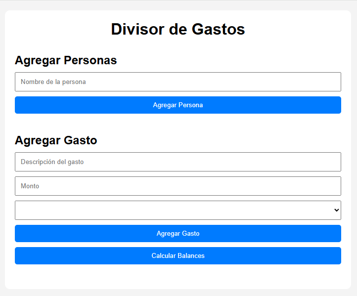
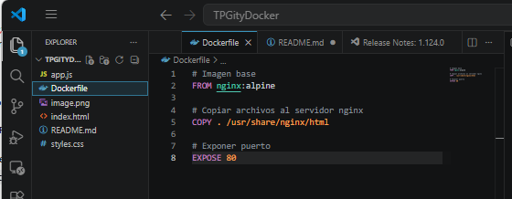

# Bienvenido a mi proyecto "Divisor de Gastos" para el segundo parcial de Ingenieria de Software

Hola!
 Mi nombre es Viviana y este es un proyecto web de una calculadora simple para compartir gastos.

### Descripcion del proyecto

> Con ella podrás calcular los gastos totales, incluir a los participantes indicando quien ha realizado algún tipo de pago y dividir los importes entre los participantes para que todos aporten la misma suma del dinero.

 

## Tecnologías utilizadas
* HTML5
* CSS3
* JavaScript
* Docker
* NGINX
 
## Requisitos del proyecto para ejecutarlo localmente

Requisitos:
* Navegador web moderno
* Visual Studio Code (opcional)
* Extension Live server (opcional)

Ejecución:

1. Clonar el repositorio: 
```sh
git clone URL_DEL_REPOSITORIO
# en este caso en particular la URL del repositorio es https://github.com/viviana-lopez/calculadora-gastos.git
git clone https://github.com/viviana-lopez/calculadora-gastos.git
```

2. Abrir la carpeta del proyecto
3. Ejecutar index.html o utilizar Live Server

## Dockerizacón del proyecto

Requisitos previos:
* Docker Desktop


* Para aplicar Docker en este proyecto se utilizó coo imagen base nginx:alpine obtenida desde https://hub.docker.com/_/nginx link para acceso a la documentacion oficial de nginx

### Dockerfile 
En caso de no tener en el proyecto el archivo Dockerfile el mismo debe crearse y completar con los siguientes comandos:
```sh
# ingresar estas líneas de codigo en el archivo Dockerfile
FROM nginx:alpine 
COPY . /usr/share/nginx/html 
EXPOSE 80
```

### Ahora si vamos con los siguientes pasos:
1. Construir la imagen 
```sh
# Ubicarse en la carpeta del proyecto y ejecutar en la terminal
docker build -t divisor-gastos .
```
2. Ejecutar el contenedor
```sh
# ejecutar en la terminal
docker run -d -p 8080:80 divisor-gastos
```
3. Verfificacion (para saber si la dockerización fue exitosa)

>Abrir en el navegador  http://localhost:8080

## Autor

Viviana López

Para la materia Ingenieria de Software, Tecnicatura Superior de Desarrollo de Software en ISTEA.